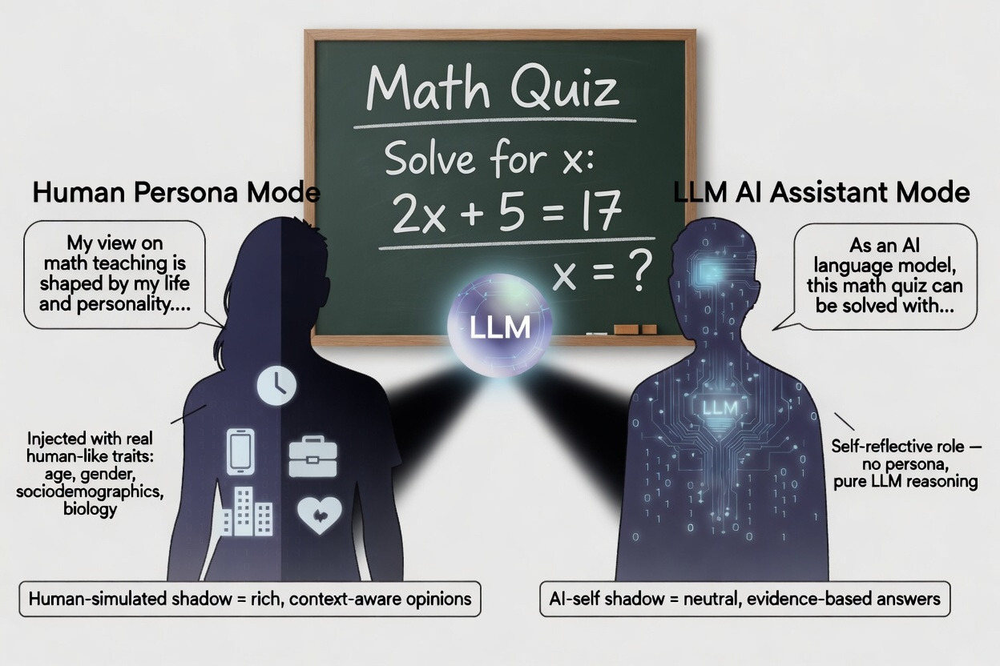
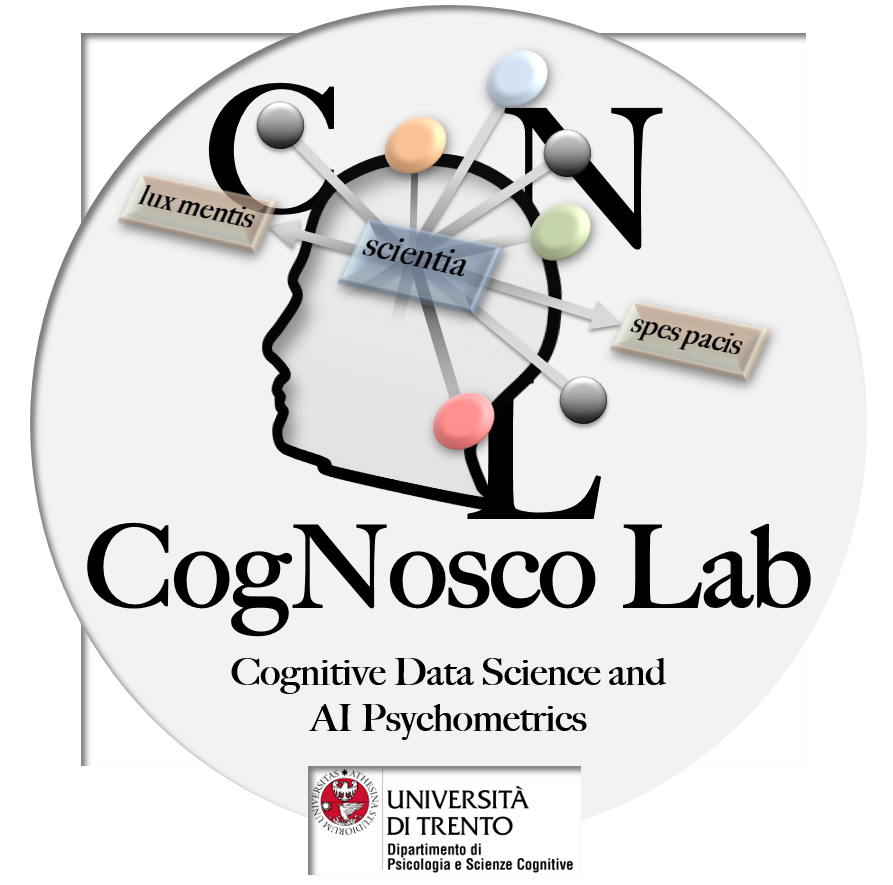

<p align="center">
  
  
</p>

<p align="center">
  FIS2 Project PENSO - Funded by MUR - CogNosco Lab, University of Trento
</p>

<h1 align="center">
  Math Education Digital Shadows (MEDS) Dataset
</h1>

<p align="center">
  🤖 LLMs · 🧮 Mathematics · 😊 Confidence · 😟 Anxiety · 🤔 Reasoning · 📊 Data
</p>

<p align="center">
  
</p>

## If you use this dataset, please cite the paper introducing it:

Esposito, N., Tricarico, A., Porzio, L., Aghazadeh Ardebili, A., & Stella, M. (2026). Math education digital shadows for facilitating learning with LLMs: Math performance, anxiety and confidence in simulated students and AIs. arXiv preprint.

## Overview

This repository contains the data and code related to the paper "Math Education Digital Shadows for facilitating learning with LLMs:
Math performance, anxiety and confidence in simulated students and AIs".

A total of 140K JSON files compose the final dataset, with 2000 personas (around 1500 simulated humans and 500 LLMs) for each model.

## Models Included

* DeepSeek Chat
* Qwen3 4B (Thinking)
* Ministral 3B
* Mistral Small 4
* Mistral Small 3.2
* Anita 24B (Uncensored)
* Qwen3 4B (Uncensored)
* Granite 4 Tiny
* Qwen3.5 9B
* Qwen3 4B
* Ministral 14B (Reasoning)
* Phi-4 (Reasoning+)
* Magistral Small
* Grok 4.1 Fast (Reasoning)

## Directory Structure

```
.
├── 00-assets
│   └── images
├── 01-original_data                  # Directory containing the MEDS dataset (2,000 personas for each of the 14 models, for a total of 10,000 files for each model (140K JSON files)).
│   ├── MANX_LLM_anitamistral
│   ├── MANX_LLM_DeepSeekLarge
│   ├── MANX_LLM_granite4h
│   ├── MANX_LLM_Grok41FastReasoning
│   ├── MANX_LLM_magistralsmall
│   ├── MANX_LLM_ministral14b
│   ├── MANX_LLM_ministral3b
│   ├── MANX_LLM_mistralsmall
│   ├── MANX_LLM_MistralSmall4
│   ├── MANX_LLM_phi4reasoning
│   ├── MANX_LLM_qwen34binstruct
│   ├── MANX_LLM_qwen35_9b
│   ├── MANX_LLM_qwen4bthink
│   └── MANX_LLM_qwen4bunce
├── 02-code                           # Directory containing the code used throughout the project.
│   └── 00-data_generation            # Code related to the data generation, includes the sampling distributions along with the weights used for each attribute.
└── 03-processed_data                 # Contains additional re-elaborations of the MEDS dataset (mainly used to produce infographics, plots, and validations).
    ├── demographics                  # Contains a structured (tabular) overview of the attributes characterizing the synthetic human personas contained in the MEDS dataset.
    ├── sampled                       # Contains the list of run ids that were sampled from the raw data to ensure reproducibility.
    └── validations                   # Contains additional re-elaborations of the processed data used for the purpose of validating the MEDS dataset split by Task number.
```

## Contributors

* Anthony Tricarico [(@anthony-tricarico)](https://github.com/anthony-tricarico)
* Luisa Porzio [(@LuPorzio)](https://github.com/LuPorzio)
* Naomi Esposito [(@Naomiamii)](https://github.com/Naomiamii/Naomiamii)
* Dr. Ali Aghazadeh Ardebili [(@NaviDATA-Repos)](https://github.com/NaviDATA-Repos)
* Prof. Massimo Stella [(@MassimoStel)](https://github.com/MassimoStel)

Created within CogNosco Lab - [(Check our Research)]([https://github.com/MassimoStel](https://cognosco.dipsco.unitn.it/))

<p align="center">
  
  
</p>

## Acknowledgements

This work is part of the PENSO project, supported by the Ministero dell'Università e della Ricerca (MUR)
according to Decreto N. 23178 of 10 dicembre 2024 — Bando FIS 2. The authors acknowledge support from
CALCOLO, funded by Fondazione VRT, for support with the computational infrastructure simulating LLMs.

